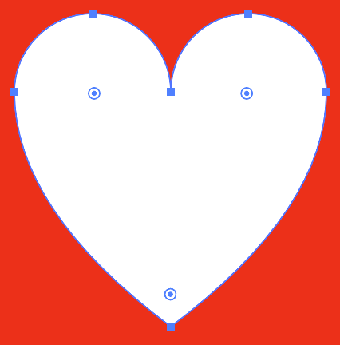

## TOC
1. [TOC](#toc)
2. [What is SVG](#what-is-svg)
3. [Why use SVG](#why-use-svg)
    1. [When not to use SVG](#when-not-to-use-svg)
    2. [Pure HTML/CSS alternative](#pure-htmlcss-alternative)
4. [Using SVG](#using-svg)
    1. [Inner workings](#inner-workings)
    2. Including SVG
    3. Manipulating SVG

## What is SVG 

SVG (Scalable Vector Graphics) is a image format that uses mathematical formula to build the image. As a simple example, a rectangle can be created from just the values for height, width, x and y position. With optional styling like rounded corners and fill colors.

By comparison, formats such as jpg, png and gif images are constructed by saving 


---
## Why use SVG

Going from the definition 


### When not to use SVG

### Pure HTML/CSS alternative
There might be cases where there isn't a SVG available, be it due to icon library not having the right option for the use case, lack of vector software (for personal projects), or even time constraints on the ux/design front. 

> **Make sure to always confirm with UX / your team before going with this approach.**

In these scenario's there is an alternative to using SVG, which is creative usage of HTML and CSS. This will be fairly similar to working with actual SVGs and can be a great additional tool to have. As well as improve your understanding of graphics/illustrations in general.

Let's say you need an icon of a magnifying glass. Think how you could build its shape using only circles, triangles and (rounded) rectangles. You'll quickly realise that you can build it from a circle for the lense and a rectangle for the handle. Therefor you can create these shapes with by styling two (psuedo-) elements. CSS even allows you to then add additional details like a rounded tip on the handle with `border-radius`, or adding a `border` to the lense to create a rim.

For more examples and inspiration have a look at this collection of [shapes made with css](https://css-tricks.com/the-shapes-of-css/).

---
## Using SVG

### Inner workings

When looking at a SVG file in an editor/IDE, you'll find a familiar to HTML. This is because both are based on XML (Extensible Markup Language), SVG is, essentially, to graphics what HTML is to text.

They follow the same rules for structure, being comprised of elements that have attributes, including things like `id` and `class`. The main difference comes from the [elements](https://developer.mozilla.org/en-US/docs/Web/SVG/Element) available.
So instead of paragraphs and headers you will have things like circles and paths.

Lets look the code that makes up the following heart illustration:


```svg
<svg viewBox="0 0 100 100" xmlns="http://www.w3.org/2000/svg">
  <rect 
    fill="#f00" 
    width="100" 
    height="100" 
    rx="15"
  />
  <path
    fill="#fff"
    d="
      M 10,30
      A 20,20 0,0,1 50,30
      A 20,20 0,0,1 90,30
      Q 90,60 50,90
      Q 10,60 10,30
      z
    "
  />
</svg>
```
As a quick explanation of the above, the SVG tag itself is used as a container for all other elements and defines the dimensions/grid the other elements are placed upon. Inside of it we have the `rect`, defining a rectangle, and the `path` which has
a special `d` attribute that takes a series of [Path Commands](https://developer.mozilla.org/en-US/docs/Web/SVG/Attribute/d#path_commands). These commands tell where and how the path needs to be drawn and are respresented in tools like Illustrator by visual controls, as shown below.


### Including SVG

SVGs can be used in HTML/JSX in the same way as other types of images:

```html

```

As well as in CSS (and its pre-processors) as a background image:

```css
figure {
  background-image: url["/path/to/image.svg"];
}
```

While it is simple to add a SVG file this way, it does not allow you to customise the SVG as it will just be loaded in as a static resource.


- [React](https://blog.logrocket.com/how-to-use-svgs-in-react/)
- [Angular](https://angular.io/guide/svg-in-templates)
- [Vuejs](https://dev.to/jacqueline/using-svgs-in-vuejs-made-simple-2e1a)